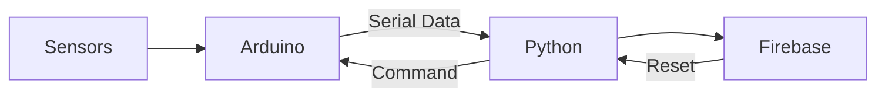

# System Architecture — Smart Sensitive Cargo Vault

## 1. Overview

This system is a layered IoT architecture designed for monitoring and securing sensitive cargo during transport.

It consists of three primary layers:

* Embedded Layer (Arduino): real-time sensing and control
* Middleware Layer (Python): communication and data processing
* Cloud Layer (Firebase RTDB): storage and remote control

---

## 2. Architecture Diagram

---

## 3. High-Level Data Flow

---

## 4. Layer Responsibilities

### Embedded Layer (Arduino)

* Sensor data acquisition
* Finite State Machine execution
* Local anomaly detection
* Actuation (LED, alarm)
* Serial communication

---

### Middleware Layer (Python)

* Serial data parsing
* Filtering and validation
* Firebase integration
* Remote command handling

---

### Cloud Layer (Firebase RTDB)

* Real-time state storage
* Remote reset control
* Central monitoring interface

---

## 5. Interaction Model

* Arduino sends event-based updates
* Python processes and forwards data
* Firebase stores latest system state
* Remote commands propagate back to Arduino

---

## 6. Design Principles

* Event-driven communication
* Separation of concerns
* Low-latency local decision-making
* Modular and extensible architecture

---

## 7. Related Documents

* State machine: `state-machine.md`
* Data flow: `data-flow.md`
* Pin configuration: `pin-diagram.md`
* Setup guide: `setup-guide.md`

---

## 8. Summary

The architecture provides a modular and scalable design, enabling reliable monitoring, efficient communication, and remote control of the system.
