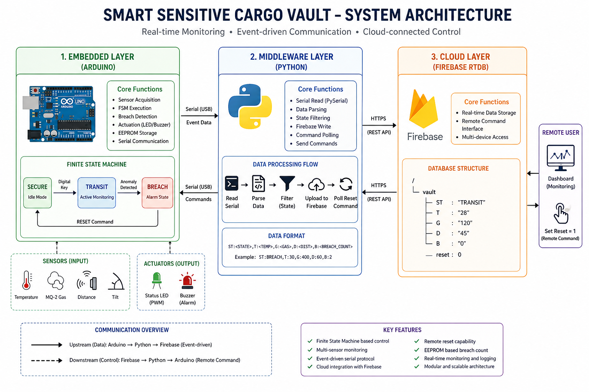
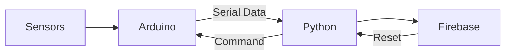
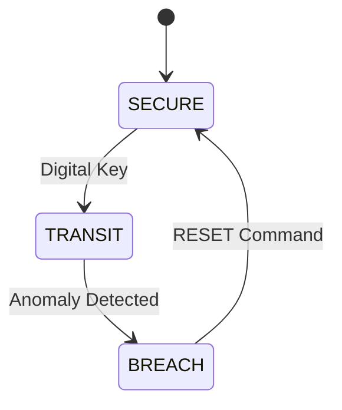
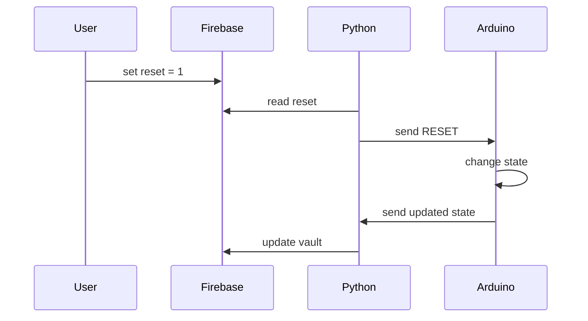

# System Architecture — Smart Sensitive Cargo Vault

## 1. Overview

The system is a layered IoT architecture designed for secure monitoring of sensitive cargo during transport. It integrates embedded sensing, event-driven communication, and cloud-based control.

The architecture is divided into three layers:

* Embedded Layer (Arduino): Real-time sensing and state control
* Middleware Layer (Python): Data parsing and communication bridge
* Cloud Layer (Firebase RTDB): Storage and remote command interface

---

## 2. Architecture Diagram



---

## 3. High-Level Data Flow



## 4. Embedded Layer (Arduino)

### Responsibilities

* Sensor acquisition (temperature, gas, distance, tilt)
* Finite State Machine execution
* Breach detection and local decision-making
* Actuation (LED PWM, buzzer)
* EEPROM-based persistence
* Serial communication

---

## 5. Finite State Machine



### States

| State   | Description       |
| ------- | ----------------- |
| SECURE  | Idle mode         |
| TRANSIT | Active monitoring |
| BREACH  | Alarm state       |

---

## 6. Communication Protocol

Arduino sends structured event data:

```
ST:<STATE>,T:<TEMP>,G:<GAS>,D:<DIST>,B:<BREACH_COUNT>
```

Example:

```
ST:BREACH,T:30,G:400,D:60,B:2
```

---

## 7. Middleware Layer (Python)

### Responsibilities

* Serial data acquisition
* Parsing structured messages
* Filtering valid states
* Uploading to Firebase
* Polling remote commands
* Sending RESET to Arduino

---

## 8. Cloud Layer (Firebase RTDB)

### Data Model

```json
{
  "vault": {
    "ST": "BREACH",
    "T": "30",
    "G": "400",
    "D": "60",
    "B": "2"
  },
  "reset": 0
}
```

---

## 9. Remote Control Flow



---

## 10. Design Characteristics

* Event-driven communication
* Separation of concerns
* Local decision-making
* Persistent state tracking
* Bidirectional control flow

---

## 11. Summary

This system demonstrates integration of embedded systems, middleware processing, and cloud-based control in a modular IoT architecture.
