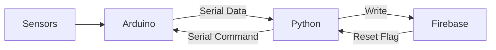
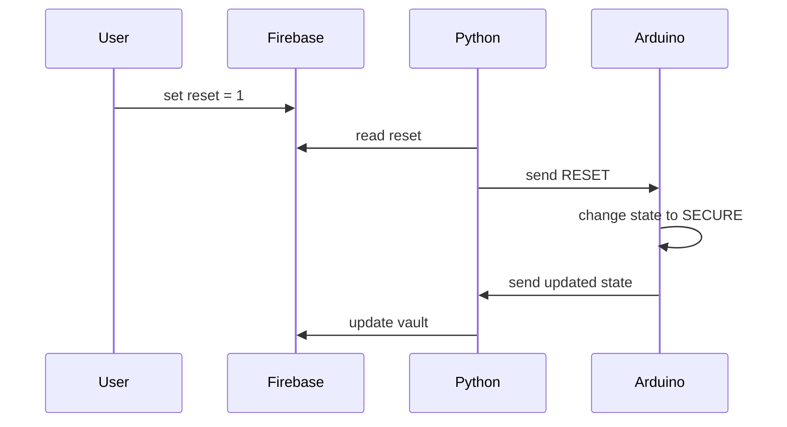

# Data Flow and Communication

## 1. Overview

The system uses a bidirectional communication pipeline:

* Upstream: Arduino → Python → Firebase
* Downstream: Firebase → Python → Arduino

Data transmission is event-driven and occurs only on state changes.

---

## 2. High-Level Flow



---

## 3. Upstream Data Flow (Monitoring)

1. Sensors generate raw readings
2. Arduino processes data using FSM
3. On state change, Arduino sends structured data via Serial
4. Python reads and parses the data
5. Valid data is uploaded to Firebase

### Example Serial Output

```text
ST:TRANSIT,T:28,G:120,D:45,B:0
```

---

## 4. Data Format Specification

The Arduino sends data in a structured key-value format:

```text
ST:<STATE>,T:<TEMP>,G:<GAS>,D:<DIST>,B:<BREACH_COUNT>
```

### Fields

| Key | Description                            |
| --- | -------------------------------------- |
| ST  | System state (SECURE, TRANSIT, BREACH) |
| T   | Temperature value                      |
| G   | Gas sensor value                       |
| D   | Distance value                         |
| B   | Breach counter (EEPROM)                |

---

## 5. Python Processing Logic

1. Read serial input line
2. Split string by comma
3. Split each pair by colon
4. Store values in dictionary
5. Validate state
6. Upload to Firebase

Only the following states are uploaded:

* TRANSIT
* BREACH

SECURE is ignored to reduce unnecessary updates.

---

## 6. Cloud Data Structure

Firebase stores the latest system state:

```json
{
  "vault": {
    "ST": "TRANSIT",
    "T": "28",
    "G": "120",
    "D": "45",
    "B": "0"
  },
  "reset": 0
}
```

---

## 7. Downstream Data Flow (Remote Control)

1. User updates `reset` value in Firebase
2. Python continuously polls the `reset` key
3. If `reset = 1`, Python sends `RESET` via Serial
4. Arduino receives command and transitions to SECURE
5. Arduino sends updated state back

---

## 8. Remote Control Sequence



---

## 9. Design Characteristics

* Event-driven communication
* Low bandwidth usage
* Structured and parseable protocol
* Bidirectional control flow
* Decoupled system layers

---

## 10. Summary

The data flow ensures efficient and reliable communication between embedded hardware and cloud infrastructure, enabling real-time monitoring and remote control of the system.
