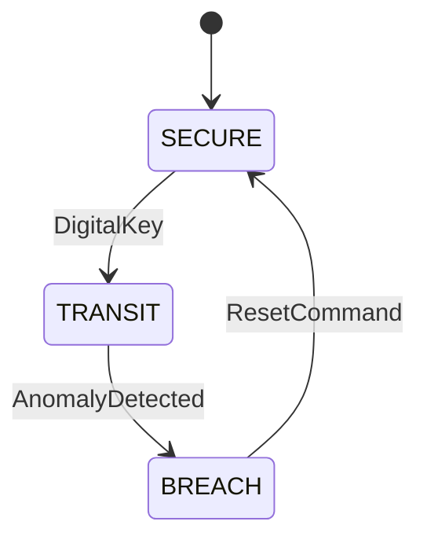

# State Machine Design

## 1. Overview

The system operates using a Finite State Machine (FSM) to manage behavior across different operational modes. Each state defines how sensors are processed and how the system responds to events.

---

## 2. State Diagram

---

## 3. States

### 3.1 SECURE

* System is idle
* Sensors are inactive or minimally monitored
* Awaiting authentication via digital key

**Outputs:**

* LED OFF
* Buzzer OFF

---

### 3.2 TRANSIT

* Active monitoring mode
* All sensors are enabled
* Continuous evaluation of system conditions

**Active Components:**

* Temperature monitoring (PWM control)
* Gas detection
* Distance monitoring
* Tilt detection

---

### 3.3 BREACH

* Alarm state triggered by anomaly
* System is locked until reset
* Breach counter updated in EEPROM

**Outputs:**

* Alarm active
* LED at maximum brightness

---

## 4. State Transitions

| From    | To      | Trigger Condition              |
| ------- | ------- | ------------------------------ |
| SECURE  | TRANSIT | Valid digital key sequence     |
| TRANSIT | BREACH  | Gas, tilt, or distance anomaly |
| BREACH  | SECURE  | RESET command from Python      |

---

## 5. Transition Logic

### Digital Key Detection

* Sequence: Long press followed by short press
* Prevents accidental activation
* Acts as authentication mechanism

---

### Anomaly Detection

Triggered when any of the following conditions occur:

* Gas value exceeds threshold
* Distance deviation exceeds defined limit
* Tilt signal detected

---

### Reset Handling

* RESET command received via Serial
* System transitions from BREACH to SECURE
* Outputs reset to safe state

---

## 6. Design Considerations

* State isolation ensures predictable behavior
* Immediate transition to BREACH on critical events
* Event-driven transitions reduce unnecessary processing
* Separation of control logic from sensor logic

---

## 7. Summary

The FSM provides a structured approach to system control, enabling reliable monitoring, fast response to anomalies, and clear separation between operational modes.
